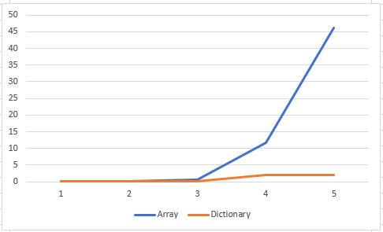
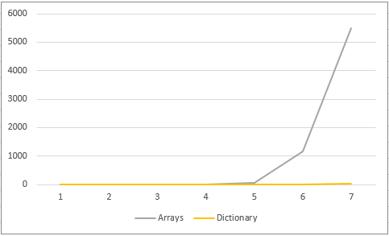

# C# Array/List iterations vs. Dictionaries
This repository contains a C# solution in .NET 6 covering the cost of iterations on array/ lists vs. Dictionaries

## Purpose
The purpose of this repository is to showcase the cost in terms of time complexity that the different datastructures have.

## Setup
Solution contains 7 testcases

| Case id | Jobs | Assignments | Resources |
| ---- | ---- | ----------- | --------- |
| 1 | 100 | 1000 | 150 |
| 2 | 500 | 5000 | 750 |
| 3 | 1000 | 10000 | 1500 |
| 4 | 5000 | 50000 | 7500 |
| 5 | 10000 | 100000 | 15000 |
| 6 | 50000 | 500000 | 75000 |
| 7 | 100000 | 1000000 | 150000 |

The main work here is to update all jobs with the releated assignments, as the assignements have the job number added when created.

### Results
#### First five testcases

X-axis is in seconds, Y-axis is Case id

#### All testcases

X-axis is in seconds, Y-axis is Case id